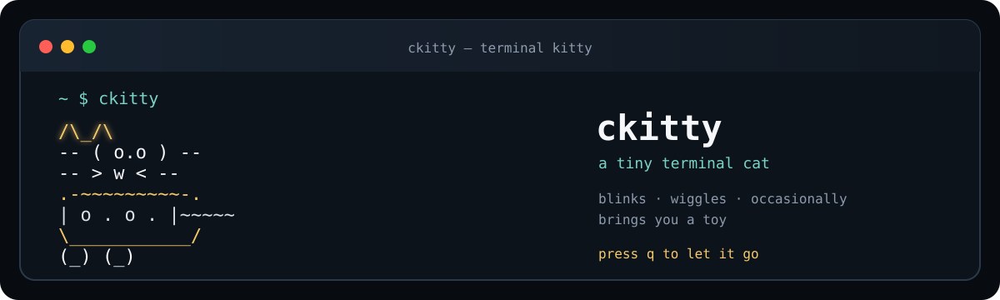
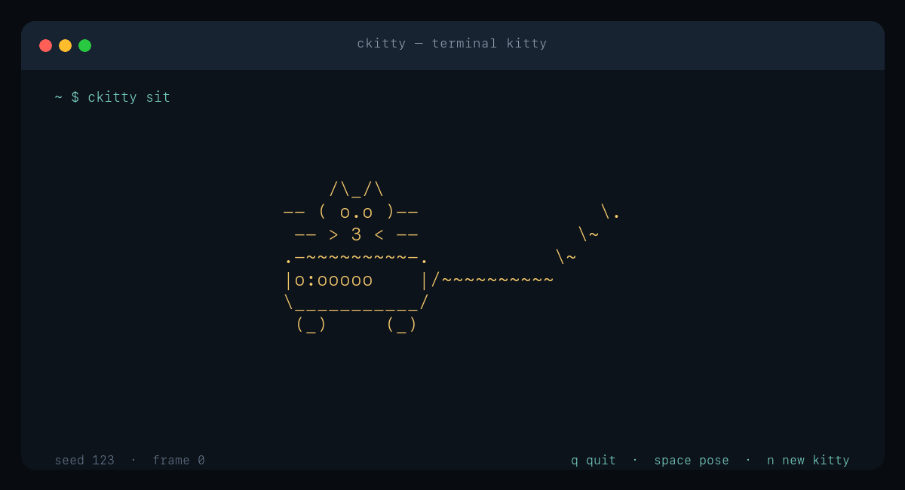

# ckitty

A tiny terminal cat. Run `ckitty`, get a little friend, press `q` when you have to go.

It blinks, wiggles its tail, changes pose, and occasionally brings a toy. It is written in C, has no runtime dependencies beyond ncurses, and is GPL-3.0 licensed.

## What it does

- One small `ckitty` binary, with a dependency-free rendering core.
- Sitting, sleeping, playing, and walking poses.
- Deterministic seeds and headless `--dump` output for scripts and CI.
- Live piece-by-piece reveal, screensaver spawning, automatic color, and rainbow mode.
- Color is automatic when the terminal supports it; `--ascii` or `NO_COLOR=1` keeps output plain and accessible.
- Safe clipping and redraw on small or resized terminals.





## A frame (seed 123)

```text
    /\_/\
-- ( o.o )--
 -- > 3 < --
.-~~~~~~~~~-.       \~~~~~~~
|o:ooooo    |      \~
\___________//~~~~~~
 (_)     (_)
```

The exact fur, pose, tail motion, and small companions vary by seed while the silhouette stays readable.

## Get a cat

On macOS or Linux, this is the easiest way:

```sh
curl -fsSL https://raw.githubusercontent.com/fortunexbt/ckitty/main/install.sh \
  | sh -s -- --prefix "$HOME/.local"
```

Then run `ckitty`. If `$HOME/.local/bin` is not on your `PATH`, add it once:

```sh
export PATH="$HOME/.local/bin:$PATH"
```

The script fetches the source, runs the checks, and installs only the binary. It never calls `sudo`. If you prefer to look around first, clone the repo and run `make`.

## Build and test

Requirements: a C11 compiler, ncurses, and libm.

```sh
make
make check              # build, core tests, CLI/error tests
make sanitize           # AddressSanitizer + UndefinedBehaviorSanitizer
make demo               # regenerate the README terminal GIF (needs ImageMagick + FFmpeg)
```

On macOS, Homebrew ncurses is detected automatically when installed:

```sh
brew install ncurses
make check
```

On Debian/Ubuntu, install `libncurses-dev`; Fedora uses `ncurses-devel`.

## Run

```sh
./ckitty                            # the whole experience
./ckitty play                       # start in a playful pose
./ckitty --ascii                    # plain ASCII, no color
./ckitty -l                         # live reveal
./ckitty -S -m "back soon"          # screensaver
./ckitty --dump --seed 123 sit      # deterministic frame for scripts
```

Use `ckitty -h` for the full option list. Interactive mode runs until `q`/Escape; Space cycles poses and `n` creates a new kitty.

`--dump` never initializes ncurses and writes only the minimal non-blank ASCII bounding box, making it useful in pipes and automated tests. `--width` and `--height` select its canvas; the renderer rejects unreasonably large canvases rather than risking an overflow.

## Install from a checkout

```sh
./install.sh --prefix "$HOME/.local"
# or, for a system prefix:
sudo make install PREFIX=/usr/local
```

The installer runs `make check` and never invokes `sudo` itself. Use `--skip-tests` only when a package build system has already verified the source. Remove an installed binary with `make uninstall PREFIX=...`.

## Release checklist

1. Update `CKITTY_VERSION` in `src/ckitty.c` and the matching documentation if the release changes.
2. Run `make clean`, `make check`, and `make sanitize` on a supported host.
3. Verify `./ckitty --dump --seed 123 sit --frame 0` and `./ckitty --help`.
4. Build with the release compiler on Linux and macOS, then package the source tree (including `src/`, `tests/`, `Makefile`, and `LICENSE`).
5. Install into a temporary prefix and verify `bin/ckitty`, then run `make uninstall` for that prefix.

There are no generated or versioned v1/v2/v3 binaries; `ckitty` is the supported product name.

## Contributing

See [CONTRIBUTING.md](CONTRIBUTING.md) and [EXAMPLES.md](EXAMPLES.md).

## License

GPL-3.0. See [LICENSE](LICENSE).
